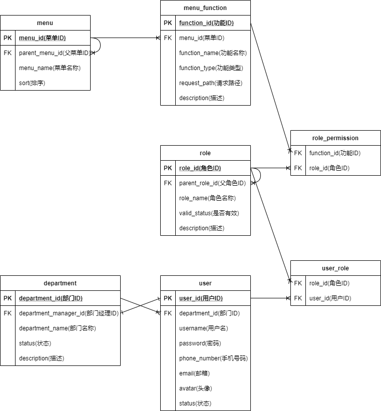
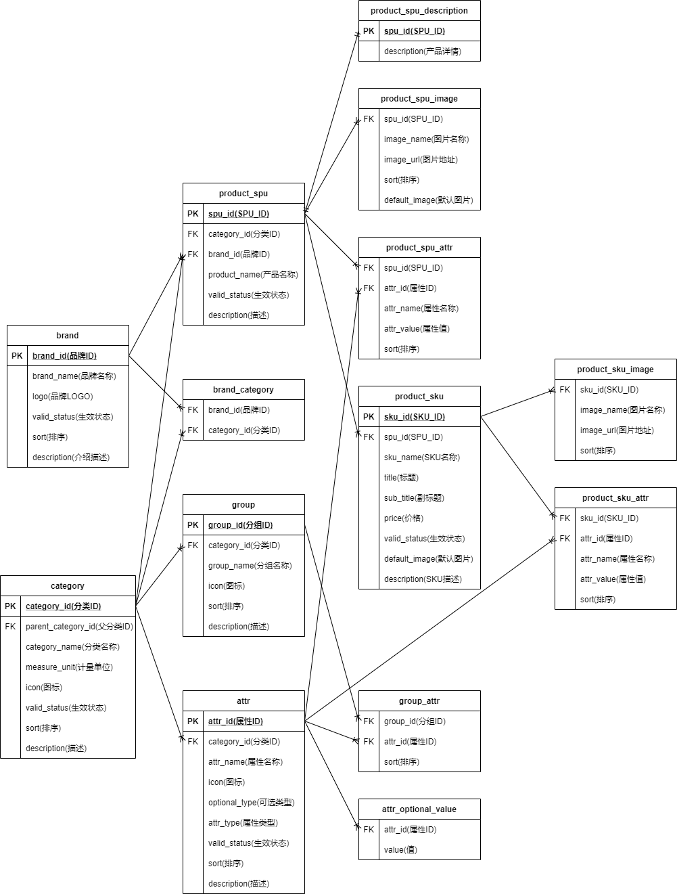
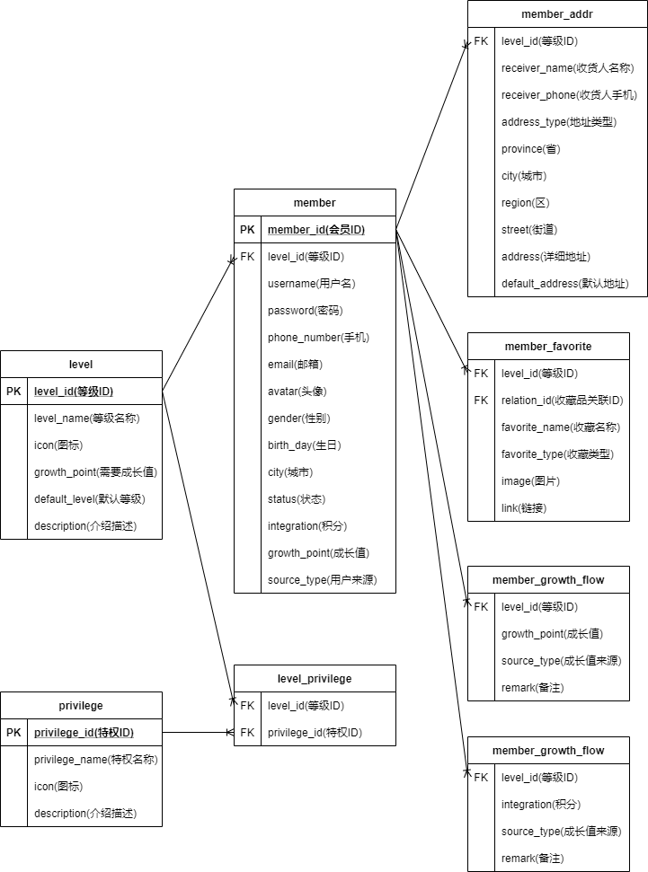
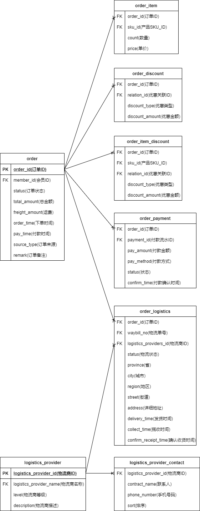
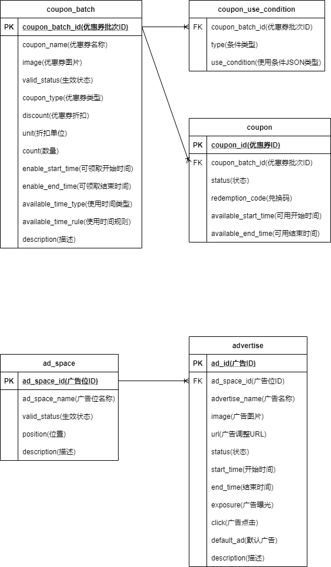
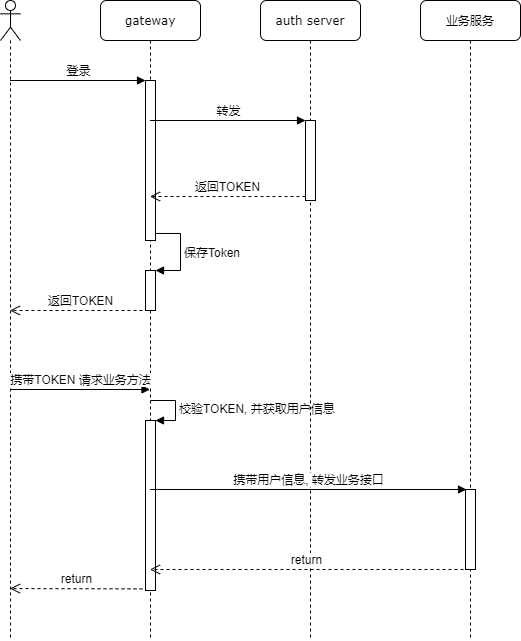

# 谷粒商城

## 项目结构

```text
mall
├── gateway   网关
├── auth      认证中心
├── user      用户服务
├── product   产品服务
├── member    会员服务
├── order     订单服务
├── warehouse 仓储服务
└── marketing 营销服务
```

## 数据库设计

### 用户服务



### 产品服务



### 会员服务



### 订单服务



### 仓储服务


### 营销服务



## 流程

### 登录与鉴权流程



